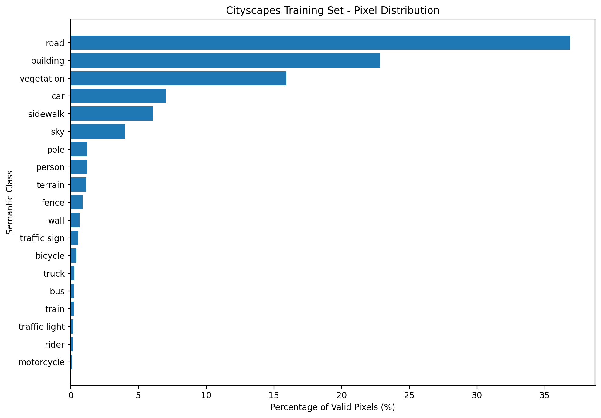
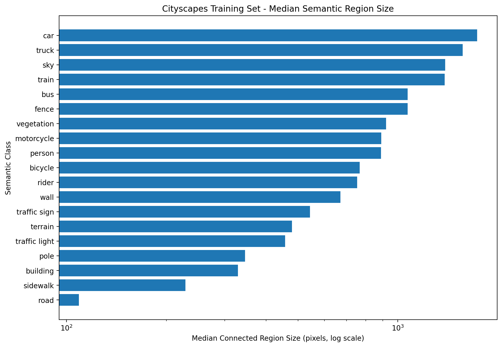
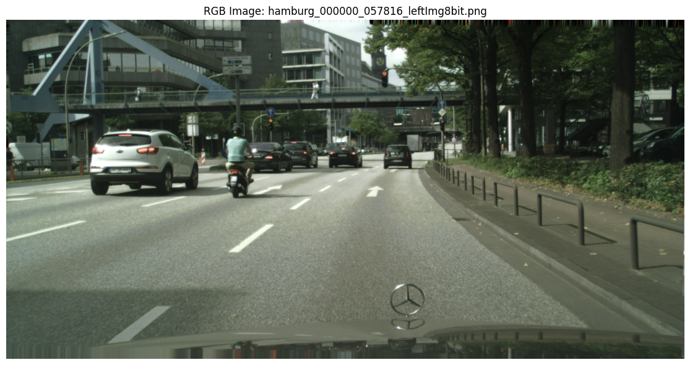
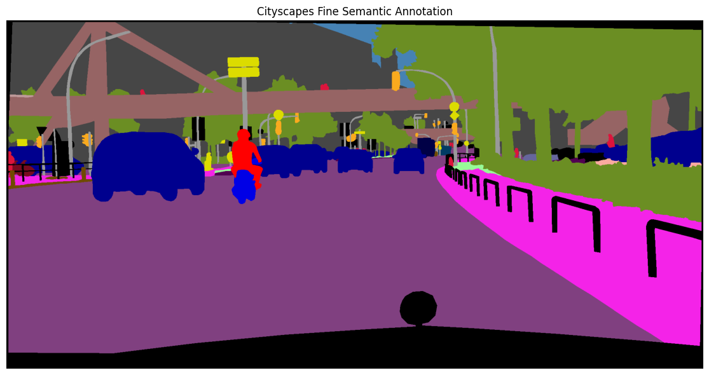

# **Deep Learning on Large-Scale Data and Specialized Tasks**

#### **Topic:** Semantic Segmentation of Urban Street Scenes using Cityscapes

**Group members:**
- Đàm Hoài An
- Nguyễn Hữu Minh Khôi
- Ngô Diễm Quyên

**Instructor:** Lê Thành Sách

---

## **1. Problem and Data**

### **Problem Statement**

This project focuses on **semantic segmentation of urban street scenes** using the Cityscapes dataset.

Given an RGB street-scene image, the model predicts a semantic class for each valid pixel. The project follows the standard Cityscapes setting with **19 evaluation classes**, including road, sidewalk, building, vegetation, person, rider, car, bus, bicycle, and other urban categories.

The main challenges include strong class imbalance, small semantic regions, scale variation, perspective, and occlusion.

---

### **Data Description and EDA**

#### **Dataset Description**

The project uses the **Cityscapes fine-annotation dataset** (`gtFine`) with RGB images from `leftImg8bit`.

| Property | Value |
|---|---|
| Task | Semantic segmentation |
| Fine-annotated images | 5,000 |
| Cities | 50 |
| Image resolution | 2048 × 1024 |
| Evaluation classes | 19 |
| Annotation | Polygon annotations and pixel-level label maps |
| Train | 2,975 images |
| Validation | 500 images |
| Test | 1,525 images |

The additional coarse-annotation `train_extra` set is not used.

The official Cityscapes train/validation split is preserved without creating a custom random split. Original label IDs are mapped to training IDs **0–18**, while labels excluded from evaluation are ignored.

---

#### **Class Distribution**

Pixel statistics were computed over all **2,975 training masks**, containing:

$$
2975 \times 1024 \times 2048
= 6,239,027,200
$$

pixels in total.

- **Valid semantic pixels:** 88.53%
- **Ignored pixels:** 11.47%

The class distribution among valid pixels is:

| Class | Percentage |
|---|---:|
| road | 36.870% |
| building | 22.824% |
| vegetation | 15.929% |
| car | 6.995% |
| sidewalk | 6.085% |
| sky | 4.019% |
| pole | 1.227% |
| person | 1.219% |
| terrain | 1.158% |
| fence | 0.877% |
| wall | 0.655% |
| traffic sign | 0.551% |
| bicycle | 0.414% |
| truck | 0.267% |
| bus | 0.235% |
| train | 0.233% |
| traffic light | 0.208% |
| rider | 0.135% |
| motorcycle | 0.099% |

  

  <em>Figure 1. Pixel-level class distribution of the Cityscapes training set.</em>

The dataset shows substantial **pixel-level class imbalance**. Road, building, and vegetation alone account for approximately **75.62%** of all valid pixels, while several classes contribute less than 0.3%.

This motivates the use of **mIoU, Dice, and per-class metrics** instead of relying only on overall pixel accuracy.

---

#### **Semantic Region Size**

Connected-component analysis was performed to examine the spatial sizes of semantic regions. Components are treated as **connected semantic regions**, not object instances.

A threshold of **1,024 pixels (32 × 32)** was used as an exploratory definition of a small region.

| Class | Median Region Size | Regions < 1,024 px |
|---|---:|---:|
| traffic light | 457 | 71.85% |
| traffic sign | 543 | 66.50% |
| rider | 753 | 56.77% |
| bicycle | 767 | 56.39% |
| person | 890 | 52.87% |
| motorcycle | 890.5 | 52.91% |

  

  <em>Figure 2. Median connected semantic-region size for each Cityscapes class.</em>

Traffic-related and human-related classes frequently appear as small regions. Together with the pixel distribution, this indicates that Cityscapes contains both **class imbalance and strong scale variation**.

---

#### **Qualitative Inspection**

Selected RGB images and their semantic annotations were visually inspected.

  

  

  <em>Figure 3. Example Cityscapes street scene and its fine semantic annotation.</em>

The examples show large regions such as road, building, and vegetation together with much smaller vehicles, riders, pedestrians, poles, and traffic infrastructure. Perspective and partial occlusion further increase segmentation difficulty.

Overall, the preliminary EDA identifies four main challenges:

- strong pixel-level class imbalance;
- large variation in semantic-region size;
- small and distant foreground regions;
- perspective and occlusion in complex urban scenes.

---

## **2. Methodology and Setup**

### **Methodology**

Two segmentation models are planned:

**Baseline — U-Net**

A U-Net trained from scratch will provide the simple baseline.

**Main model — DeepLabV3-ResNet50**

DeepLabV3 with an ImageNet-pretrained ResNet-50 backbone will be fine-tuned on Cityscapes with a 19-class segmentation head.

The main controlled experiment will compare:

$$
L = L_{CE}
$$

with:

$$
L = L_{CE} + \lambda L_{Dice}
$$

**Hypothesis:** combining Dice loss with Cross-Entropy may improve segmentation performance under the observed class imbalance and region-size variation.

Only the loss formulation will be intentionally changed. Model architecture, data split, preprocessing, augmentation, optimizer, learning-rate schedule, batch size, training duration, random seed, checkpoint criterion, and evaluation procedure will remain fixed.

---

### **Experimental Setup**

The official Cityscapes split will be used:

- **Training:** 2,975 images
- **Validation:** 500 images

Training will be performed using **Kaggle GPU acceleration**. Because the original resolution is 2048 × 1024, an appropriate training crop/resolution will be selected according to available GPU memory.

Planned preprocessing includes resizing/cropping, normalization, and random horizontal flipping for training.

The primary evaluation metric is **mean Intersection over Union (mIoU)**:

$$
IoU_c =
\frac{TP_c}{TP_c + FP_c + FN_c}
$$

$$
mIoU =
\frac{1}{19}\sum_{c=1}^{19} IoU_c
$$

**Dice score** and **per-class IoU/Dice** will also be reported.

---

## **3. Results and Analysis**

### **Results**

### **Comparison and Discussion**

### **Error Analysis**

### **Limitation and Conclusion**

---

## **4. Links**

**Source code:**

**Links to checkpoints:**

**Links to report/slides:**

**Links to YouTube presentation video:**

---

## **5. AI Usage Disclosure**

**Tool:** 

---

## **References**

[1] M. Cordts et al., “The Cityscapes Dataset for Semantic Urban Scene Understanding,” *CVPR*, 2016.

[2] O. Ronneberger, P. Fischer, and T. Brox, “U-Net: Convolutional Networks for Biomedical Image Segmentation,” *MICCAI*, 2015.

[3] L.-C. Chen, G. Papandreou, F. Schroff, and H. Adam, “Rethinking Atrous Convolution for Semantic Image Segmentation,” arXiv:1706.05587, 2017.

[4] Cityscapes Dataset: https://www.cityscapes-dataset.com/

[5] Cityscapes Scripts and Label Definitions: https://github.com/mcordts/cityscapesScripts